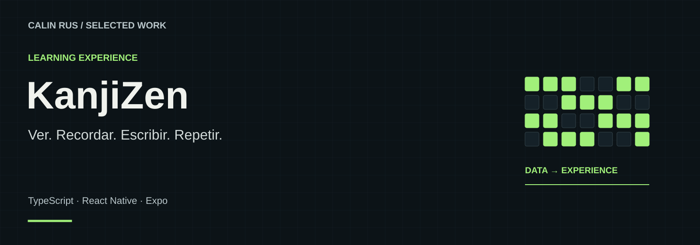

# KanjiZen

**Del símbolo al reflejo.**

Un dojo digital de japonés que conecta recuerdo activo, memoria gestual y retos contrarreloj. La primera ruta jugable combina hiragana, MECA y teclado Flick con progresión por dominio y continuidad local.

**Stack:** TypeScript · React Native · Expo  
**Estado:** Primera ruta jugable · Hiragana, MECA y Flick

[Portfolio](https://github.com/calinrus-dev/portfolio) · [Experiencia](docs/EXPERIENCIA.md) · [Componentes](docs/COMPONENTES.md) · [Diseño técnico](docs/ARQUITECTURA.md) · [Demostraciones](docs/DEMOSTRACIONES.md) · [Estado](docs/ESTADO.md)

## El problema que aborda

Leer un carácter, recordar su sonido y producirlo con un gesto requieren habilidades distintas. KanjiZen las conecta en un entrenamiento que alterna aprendizaje con guía, respuesta autónoma y progresión por dominio, con la intención de hacer la práctica más directa y consistente.

## Qué compone la experiencia

- **MECA · lectura activa.** Producir la lectura del kana mediante teclado, con práctica guiada y retos contrarreloj.
- **Flick · memoria gestual.** Aprender y reproducir kana mediante las direcciones de un teclado Flick.
- **Campaña por dominio.** Abrir nuevas filas al demostrar lectura y reproducción autónomas.
- **Progreso local.** Colección, XP, nivel e historial de sesiones conservados en el dispositivo.

*Lámina explicativa con datos ficticios. Su contenido también está disponible como texto en [Componentes](docs/COMPONENTES.md).*

## Galería real

*Inicio real de la preview web con perfil de prueba.*

*Ejercicio guiado real de Flick en la preview web.*

## Decisiones que definen el proyecto

- **Ayuda y autonomía tienen funciones distintas.** La guía sirve para aprender; las respuestas sin ayuda aportan evidencia de dominio.
- **Una habilidad necesita varias formas de práctica.** Lectura MECA y reproducción Flick mantienen su contexto, pero contribuyen al mismo recorrido.
- **El entrenamiento debe estar cerca.** Catálogo y progreso local mantienen la continuidad de la práctica sin exigir una cuenta remota.

## Explorar el caso

- [Experiencia y recorrido](docs/EXPERIENCIA.md): intención, interacción y criterios de revisión.
- [Componentes](docs/COMPONENTES.md): las piezas visibles y el papel de cada una.
- [Diseño técnico](docs/ARQUITECTURA.md): responsabilidades y compromisos de diseño.
- [Demostraciones](docs/DEMOSTRACIONES.md): qué enseñan las imágenes y cómo leer la evidencia.
- [Estado y siguientes pasos](docs/ESTADO.md): alcance actual, comprobaciones y trabajo pendiente.

## Sobre este repositorio

Caso de estudio público de un proyecto con implementación privada. Reúne documentación, diagramas e imágenes seleccionadas. Los detalles del motor, integraciones, datos operativos y código se mantienen en los repositorios privados.

Revisión editorial: 28 de septiembre de 2026. Autor: [Calin Rus](https://github.com/calinrus-dev).

[calinrus.com](https://calinrus.com) · [Instagram @c4linrus](https://www.instagram.com/c4linrus/) · [Todos los proyectos](https://github.com/calinrus-dev/portfolio)
