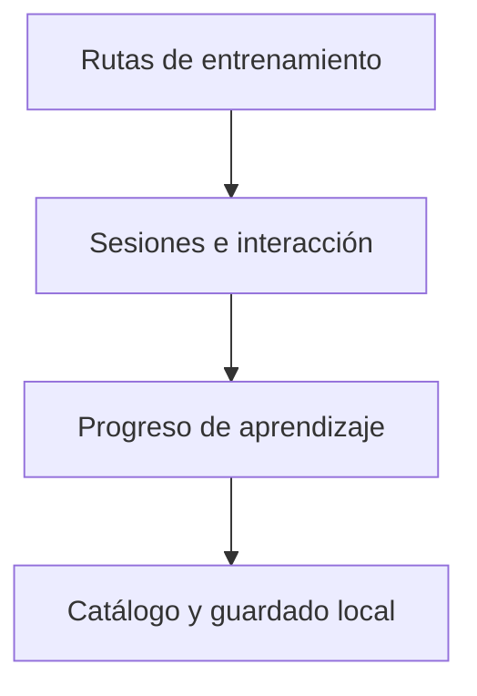

# KanjiZen / Diseño técnico

[← Inicio](../README.md)

## Contexto

Un dojo digital de japonés que conecta recuerdo activo, memoria gestual y retos contrarreloj. La primera ruta jugable combina hiragana, MECA y teclado Flick con progresión por dominio y continuidad local.

**Tecnologías asociadas al proyecto:** TypeScript · React Native · Expo.

## Mapa de responsabilidades

Este mapa conceptual organiza la explicación del producto; no representa endpoints, procesos desplegados ni contratos internos.

## Ayuda y autonomía tienen funciones distintas

La guía sirve para aprender; las respuestas sin ayuda aportan evidencia de dominio.

## Una habilidad necesita varias formas de práctica

Lectura MECA y reproducción Flick mantienen su contexto, pero contribuyen al mismo recorrido.

## El entrenamiento debe estar cerca

Catálogo y progreso local mantienen la continuidad de la práctica sin exigir una cuenta remota.

## Rendimiento y dependencia

Mi criterio de trabajo es medir antes de optimizar: identificar el recorrido relevante, observar tiempo de respuesta y uso de recursos y comparar cambios con la misma carga. En sistemas nativos también me interesa la disposición de datos, la localidad de memoria y el trabajo repetido.

Local-first es una preferencia arquitectónica: conservar una experiencia útil y control sobre los datos en el dispositivo, e incorporar servicios externos cuando aporten una función concreta. Su alcance varía por proyecto; no implica que todas las integraciones de este caso funcionen sin conexión.

No se publican cifras de rendimiento sin un ensayo identificado. La evidencia específica disponible está en [Estado](ESTADO.md).

## Qué conviene demostrar después

- Consolidar las campañas de kana.
- Ampliar accesibilidad y pruebas de interacción nativa.
- Evolucionar hacia nuevos recorridos de kanji con evidencia de uso.
