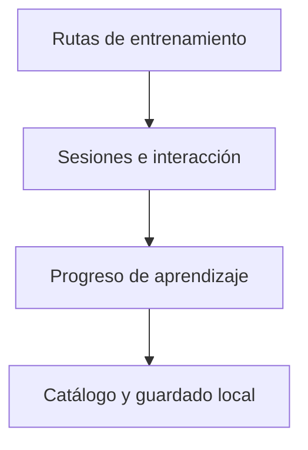

# KanjiZen / Diseño técnico

[← Inicio](../README.md)

## Contexto

Entrenamiento de lectura y escritura de kana mediante sesiones breves, entrada por teclado y gestos Flick, con progreso local.

**Tecnologías asociadas al proyecto:** TypeScript · React Native · Expo.

## Mapa de responsabilidades

Este mapa conceptual organiza la explicación del producto; no representa endpoints, procesos desplegados ni contratos internos.

## Reconocer no equivale a dominar

La práctica con ayuda y la respuesta autónoma se distinguen en la experiencia.

## Cada motor conserva su contexto

Cambiar de ejercicio no debe arrastrar una respuesta ni un temporizador anterior.

## Continuidad sin fricción

Las sesiones y las preferencias se recuperan localmente sin depender de una cuenta remota.

## Rendimiento y dependencia

Mi criterio de trabajo es medir antes de optimizar: identificar el recorrido relevante, observar tiempo de respuesta y uso de recursos y comparar cambios con la misma carga. En sistemas nativos también me interesa la disposición de datos, la localidad de memoria y el trabajo repetido.

Local-first es una preferencia arquitectónica: conservar una experiencia útil y control sobre los datos en el dispositivo, e incorporar servicios externos cuando aporten una función concreta. Su alcance varía por proyecto; no implica que todas las integraciones de este caso funcionen sin conexión.

No se publican cifras de rendimiento sin un ensayo identificado. La evidencia específica disponible está en [Estado](ESTADO.md).

## Qué conviene demostrar después

- Consolidar las campañas de kana.
- Ampliar accesibilidad y pruebas de interacción nativa.
- Evolucionar hacia nuevos recorridos de kanji con evidencia de uso.
