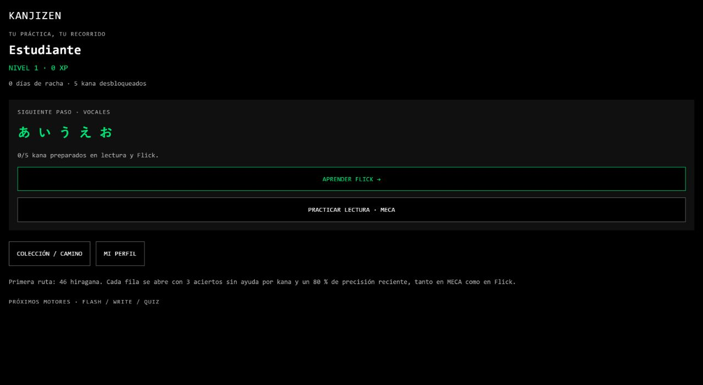
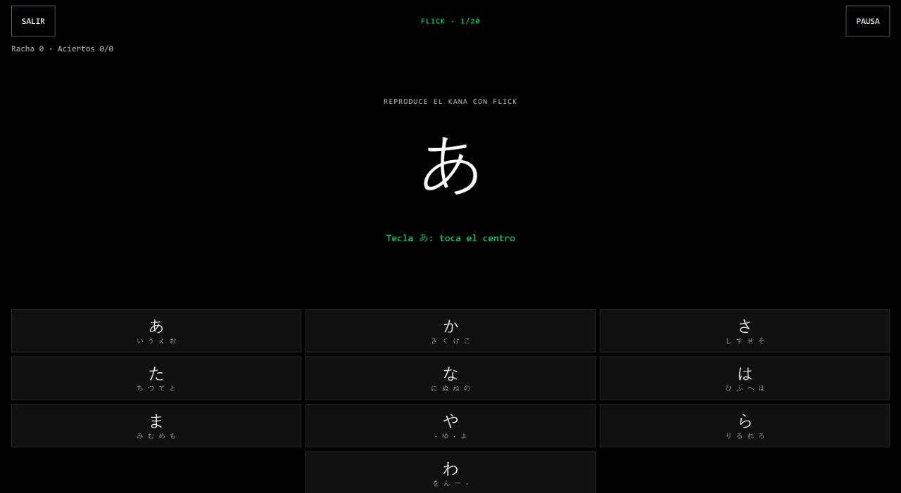
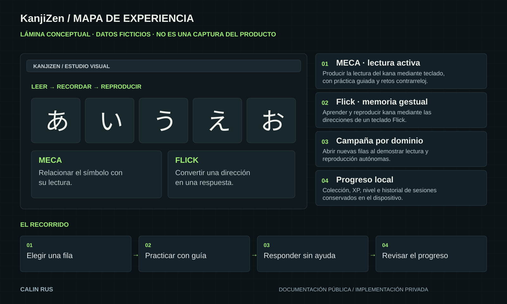

# KanjiZen / Demostraciones

[← Inicio](../README.md)

## Qué enseña esta publicación

Capturas reales de la preview web local: inicio y ejercicio guiado de Flick.

El 28 de septiembre de 2026 se abrió la aplicación, se entró en práctica guiada y se comprobó una respuesta central correcta. No se atribuye esta comprobación parcial a una campaña completa.

## Capturas reales

*Inicio real de la preview web con perfil de prueba.*

*Ejercicio guiado real de Flick en la preview web.*

## Guion del caso de estudio

Este guion sirve para explicar el recorrido documentado y preparar una demostración controlada. No afirma que se haya ejecutado completo durante esta publicación.

1. **Elegir una fila.** Observar: Producir la lectura del kana mediante teclado, con práctica guiada y retos contrarreloj.
2. **Practicar con guía.** Observar: Aprender y reproducir kana mediante las direcciones de un teclado Flick.
3. **Responder sin ayuda.** Observar: Abrir nuevas filas al demostrar lectura y reproducción autónomas.
4. **Revisar el progreso.** Observar: Colección, XP, nivel e historial de sesiones conservados en el dispositivo.

## Lectura de la lámina

La ilustración reúne las piezas y sus relaciones. Sus estados, textos de muestra y formas son editoriales. Las capturas reales, cuando existen, aparecen identificadas por separado.

## Evidencia disponible

La revisión del 28 de septiembre de 2026 verificó arranque web, entrada en Flick guiado y una respuesta correcta reflejada en el contador. La documentación de la primera entrega describe además práctica, desbloqueo y conservación tras recarga; esos recorridos completos no se repitieron en esta revisión. Los motores futuros de kanji se mantienen separados de la experiencia actual de kana.

[Alcance y próximos pasos](ESTADO.md)
